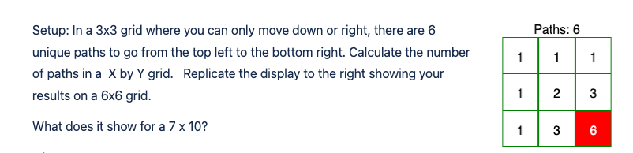

# Grid Path Project

A UI project that showcases displaying a grid with the number of possible paths
to a particular cell in the grid.



## Getting Started

```
// Install node modules
npm Install

// Run dev command
npm run dev
```

## Tests

I've included some basic testing for the grid creation. That said, I have purposely 
avoided adding specs for the components because it would be quite time consuming setting
up the boilerplate for the limited functionality that exists.

You can run them by utilizing the `test` npm script.

```sh
// Run tests
npm run test
```
